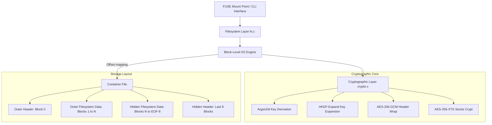

# DenyFS — Deniable Encrypted Container Filesystem

DenyFS is a security-hardened, user-space encrypted container filesystem designed to defend against coercion and leakage. Built from first principles in C, DenyFS implements a dual-key hierarchy, sector-level AES-256-XTS encryption, and an on-disk filesystem structure with hidden volume deniability and timing side-channel protections.

---

## Architecture Overview

DenyFS implements a strict layered architecture mapping high-level user-space operations down to cryptographically secure on-disk offsets.



### On-Disk Container Layout
```
[Byte 0 – 4095]         Outer volume header (AES-256-GCM, key from outer password)
                         Contains: wrapped keys, size, and bitmap offset.

[Byte 4096 – N]          Outer volume data region (Superblock, block allocation bitmap, 
                         inode table, and flat directory). Size is V_out.

[Byte N – EOF-32KB]      Free space / Hidden volume data region. Filled with CSPRNG
                         random bytes at creation. Hidden volume files reside at the
                         end of this region.

[Byte EOF-32KB – EOF]    Hidden volume header (AES-256-GCM, key from hidden password).
```

### Key Hierarchy
```
Password ──Argon2id(salt)──► Master Key
                                 │
            ┌────────────────────┼────────────────────┐
            ▼                    ▼                     ▼
      Header Key            Volume Key            HMAC/Integrity Key
     (AES-256-GCM)         (AES-256-XTS)           (HMAC-SHA256)
```

---

## Key Features

1. **Deniable Hidden Volume**:
   - The hidden volume header lives at a fixed offset (`EOF - 32KB`) disguised inside the high-entropy CSPRNG tail.
   - Without the hidden password, the hidden volume header and data are mathematically indistinguishable from random bytes.
2. **Timing Side-Channel Protection**:
   - Decryption always reads both outer and hidden headers, derives both keys using Argon2id, and performs GCM decryption sequentially.
   - Average decryption time is statistically identical (~380–390 ms) whether a hidden volume exists or not, preventing timing-based presence detection.
3. **Outer-Mount Protection**:
   - Mounting the outer volume with `--protect-hidden` reads the hidden header to map its block range in memory.
   - Any writes to the outer volume targeting sectors inside the hidden range are rejected with `ENOSPC`, preventing accidental overwrites.
4. **Memory Hygiene**:
   - All key materials, master keys, and password buffers are allocated using `sodium_malloc`, locked with `sodium_mlock` (preventing swapping to disk), and zeroed out using `sodium_memzero` upon release.
   - Core dumps are disabled at process startup (`setrlimit(RLIMIT_CORE, 0)`) to prevent transient keys leaking in post-crash core dumps.
5. **No Metadata Leakage**:
   - Access time updates are suppressed on the container file using `O_NOATIME` where supported.
   - Warning banners instruct users on GVFS, systemd logging, and desktop indexer bypasses.

---

## Build and Installation

### Prerequisites
Compile and run under Linux (native or WSL2 Ubuntu 26.04).
```bash
sudo apt-get update
sudo apt-get install build-essential pkg-config libssl-dev libsodium-dev libfuse3-dev
```

### Build Commands
Compile all targets (main binary, cryptographic unit tests, volume tests, filesystem tests, timing tests):
```bash
make clean && make all
```

### Running Test Suite
Execute the entire test suite under AddressSanitizer (ASan) and UndefinedBehaviorSanitizer (UBSan):
```bash
make test
```

---

## CLI Usage

### 1. Create a Container
Creates a 10MB container file filled with CSPRNG random bytes and formats the outer volume:
```bash
./denyfs create secure.img --size 10 --password MyOuterPass
```

### 2. Create a Hidden Volume
Formats and inserts a 3MB hidden volume at the end of the container:
```bash
./denyfs create-hidden secure.img --password MyOuterPass --hidden-password MyHiddenPass --size 3
```

### 3. Open/Authenticate a Volume
Autodetect and authenticate either volume:
```bash
./denyfs open secure.img --password MyOuterPass
./denyfs open secure.img --password MyHiddenPass
```

### 4. Mount Volume (FUSE)
Mount either volume:
```bash
mkdir -p /tmp/mount
./denyfs mount secure.img --password MyOuterPass --mountpoint /tmp/mount
```

Mount outer volume with hidden-volume protection:
```bash
./denyfs mount secure.img --password MyOuterPass --protect-hidden --hidden-password MyHiddenPass --mountpoint /tmp/mount
```

---

## Known Limitations

- **Snapshot Vulnerability**: DenyFS cannot protect against an adversary who takes repeated historical snapshots of the container over time. Diffing the container will reveal sector changes in the hidden region.
- **Flat Filesystem**: The custom filesystem structure supports flat directories only (no subdirectories).
- **Hard Limits**:
  - Max file size: 96KB (24 direct blocks × 4096 bytes).
  - Max files per volume: 63 (64 inodes, inode 0 is root dir).
- **DRAM Seizure**: Active mounts are susceptible to physical DMA or cold-boot attacks reading DRAM contents.
- **Build Integrity**: No build integrity checks or reproducible compilation paths exist. A backdoored binary voids all security properties. See [BUILD_INTEGRITY.md](BUILD_INTEGRITY.md) for the full scope statement covering reproducible builds, code signing, and supply-chain compromise.
- **Full threat model**: See [THREAT_MODEL.md](THREAT_MODEL.md) for the complete adversary model, defended/undefended threats, and host-environment metadata leak guidance.

---

## Roadmap

- [x] **Phase 1: Crypto Core**: Implement KDF (Argon2id), HKDF, AES-256-GCM, and AES-256-XTS sector crypt.
- [x] **Phase 2: Sector I/O**: Expose sector read/write operations and verify cipher uniqueness.
- [x] **Phase 3: Filesystem**: Build superblock, bitmap allocation, inodes, directory entries, and FUSE operations.
- [x] **Phase 4: Hardening**: Timing protections, core dump limits, secure memory locking, and outer protection.
- [x] **Phase 5: Build Integrity Note**: Document scope limitations around code signing, reproducible builds, and binary/compiler compromise. See [BUILD_INTEGRITY.md](BUILD_INTEGRITY.md).
- [x] **Phase 6: Fuzzing & Stress Tests**: AFL++ harnesses for header parser and sector crypto, 10 seeded correctness and stress tests (corruption, capacity, boundary, rapid cycles).
- [x] **Phase 7: Benchmarks**: Container creation, mount time, R/W throughput, peak memory, raw XTS/KDF microbenchmarks. See [BENCHMARKS.md](BENCHMARKS.md).
- [x] **Phase 8: Threat Model & Writeup**: Adversary model, defended/undefended threat analysis, crypto rationale, security property evidence matrix, interview framing. See [THREAT_MODEL.md](THREAT_MODEL.md).
