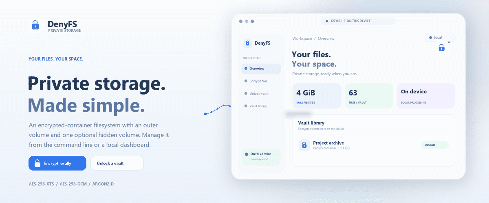

<div align="center">
  <a name="top"></a>
  
  <br><br>
  <h1>DenyFS</h1>
  <p><strong>Private storage. Made simple.</strong></p>
  <p>An encrypted-container filesystem with an outer volume and one optional hidden volume.</p>
  <p>
    <a href="#quick-start"></a>
    <a href="documentation.md"></a>
    <a href="#dashboard"></a>
  </p>
  <p>
    <a href="https://github.com/Akilan4757/Denyfs/actions/workflows/ci.yml"></a>
    
    
    
  </p>
  <p><sub>LOCAL FIRST &nbsp;·&nbsp; ENCRYPTED STORAGE FOR LINUX</sub></p>
</div>

---

> **Security and operating scope** &nbsp; DenyFS is a local encrypted-storage application for Linux and WSL2, with command-line and browser-dashboard workflows. It has not undergone independent security review. File blocks are not authenticated, and the filesystem has no crash journal. Its hidden-volume design addresses a limited single-snapshot scenario; it does not hide host evidence or protect a compromised device. Review these limits and keep separate backups before choosing DenyFS for your data.

<div align="center">
  <a href="#how-it-works">How it works</a> &nbsp;·&nbsp;
  <a href="#quick-start">Quick start</a> &nbsp;·&nbsp;
  <a href="#dashboard">Dashboard</a> &nbsp;·&nbsp;
  <a href="#capacity">Capacity</a> &nbsp;·&nbsp;
  <a href="#security-model">Security model</a> &nbsp;·&nbsp;
  <a href="#documentation">Documentation</a>
</div>

## A small filesystem. Inside one file.

DenyFS turns a regular container file into an encrypted filesystem. Mount it on
Linux and use it like a directory. A second passphrase can open one hidden
volume stored in unused container space.

<table>
  <tr>
    <td align="center" width="33%"><strong>01 &nbsp; ENCRYPT</strong><br><br>Choose a passphrase and create a local container.</td>
    <td align="center" width="33%"><strong>02 &nbsp; STORE</strong><br><br>Read and write files through a FUSE mount.</td>
    <td align="center" width="33%"><strong>03 &nbsp; UNLOCK</strong><br><br>Open the outer or optional hidden volume.</td>
  </tr>
</table>

### Designed for local file workflows

| Capability | Implementation |
|---|---|
| Password-based key derivation | Argon2id via libsodium |
| Authenticated volume headers | AES-256-GCM via OpenSSL |
| Filesystem block encryption | AES-256-XTS, 4096-byte blocks |
| Bitmap integrity | HMAC-SHA256 |
| Filesystem interface | Single-threaded Linux FUSE |
| Local file dashboard | Python standard library + HTML/CSS/JavaScript |

<details>
  <summary><strong>What can I store?</strong> &nbsp; 4 GiB maximum per file · 63 files per volume</summary>

DenyFS has a flat root directory, no subfolders, and a fixed container size.
Total usable space depends on the outer or hidden volume size and its
filesystem metadata. Sparse files can have a 4 GiB logical size while using
less physical space.

</details>

## Quick start

### 1. Install dependencies

On Ubuntu or Debian:

```bash
sudo apt update
sudo apt install build-essential pkg-config libsodium-dev libssl-dev libfuse3-dev fuse3
```

### 2. Build and create a small container

Run from the directory containing the `Makefile`:

```bash
make release
mkdir -p ~/denyfs-vaults /tmp/denyfs-vault
./denyfs-release create ~/denyfs-vaults/demo.denyfs --size 64
```

The CLI asks for a passphrase without echoing it. Container creation fills the
entire file with random bytes, so the 64 MiB example needs at least 64 MiB free.

### 3. Mount, use, and unmount

```bash
./denyfs-release mount ~/denyfs-vaults/demo.denyfs --mountpoint /tmp/denyfs-vault
```

Use `/tmp/denyfs-vault` from another terminal while the mount command runs.
When finished:

```bash
fusermount3 -u /tmp/denyfs-vault
```

<details>
  <summary><strong>Create a hidden volume</strong> &nbsp; Use a different passphrase</summary>

```bash
./denyfs-release create-hidden ~/denyfs-vaults/demo.denyfs --size 8
```

The command asks for the outer passphrase, then the hidden-volume
passphrase. The hidden volume is created in available unused space. The
format has one hidden-volume slot; do not run this command again over data
you want to keep.

</details>

## A dashboard for local files

The browser dashboard uses the same DenyFS release binary and FUSE filesystem.
It creates real DenyFS containers; it does not use a separate browser-only
encryption format.

<a name="dashboard"></a>

```bash
make dashboard
```

Open <http://127.0.0.1:8765>. Select files to encrypt, unlock a container, and
download selected files as plaintext. The dashboard binds to loopback and
stores encrypted containers in `~/.local/share/denyfs-dashboard/vaults/` by
default. Decrypted downloads go to the browser's normal download location.

<details>
  <summary><strong>Dashboard workflow and data locations</strong></summary>

- Run the dashboard inside Linux or WSL2 with `/dev/fuse` and `fusermount3`.
- Keep vault files in the Linux filesystem when using WSL2; use `/tmp` for
  mount points.
- Import copies an encrypted container into the local library. Export saves
  an encrypted container to a location chosen by the browser.
- Lock the vault when finished. The dashboard does not erase plaintext
  downloads after saving them.

See the [dashboard guide](dashboard/README.md) for setup and detailed steps.

</details>

## Capacity

One file can be up to **4 GiB**. A fully allocated 4 GiB file needs at least a
**4101 MiB volume**. To provide that as a hidden volume, use an **8203 MiB
container**. DenyFS random-fills the full container on creation, so this example
requires more than 8 GiB of free space and may take several minutes.

<details>
  <summary><strong>What the 4 GiB test means</strong></summary>

The stress and FUSE checks exercise sparse-file mapping, persistence, and
reads/writes near the final byte of a 4 GiB logical file. They do not write
four billion bytes of physical file data or benchmark an 8 GiB container
creation. See [the benchmark notes](BENCHMARKS.md) for measured throughput.

</details>

## How it works

<a name="how-it-works"></a>

```text
Passphrase
    │
    ▼
Argon2id ──► header key ──► AES-256-GCM header authentication
                                  │
                    ┌─────────────┴─────────────┐
                    ▼                           ▼
              random XTS key              bitmap HMAC key
                    │                           │
                    ▼                           ▼
       AES-256-XTS filesystem blocks      allocation bitmap check
                    │
                    ▼
          DenyFS filesystem ──► FUSE ──► mounted directory
```

The container starts with an encrypted outer header and outer filesystem.
Unused space is random-filled; the optional hidden filesystem and its encrypted
header occupy a separate region. Each volume has its own keys and filesystem
metadata.

## Security model

**The header is authenticated. File blocks are not.** AES-GCM detects an
incorrect key or changed header. AES-XTS encrypts filesystem blocks but does
not authenticate their contents. The allocation bitmap has an HMAC; that does
not cover every file block or all filesystem metadata.

The hidden-volume design aims to make a single container snapshot ambiguous.
Repeated snapshots, host logs, desktop indexers, previews, backups, and a
compromised device can expose activity. DenyFS has no crash journal, secure
delete, automatic backup, resize operation, or formal security review.

<details>
  <summary><strong>Read the threat model</strong></summary>

- [Threat model](THREAT_MODEL.md)
- [Build integrity statement](BUILD_INTEGRITY.md)
- [Architecture and build plan](DenyFS-Architecture-and-Build-Plan.md)

</details>

## Verification and performance

```bash
make test         # crypto, sector I/O, filesystem, timing, and stress checks
make test-fuse    # FUSE integration smoke test (Linux with /dev/fuse)
./test_bench      # optional benchmark run
```

The latest documented run passed all five `make test` programs and the FUSE
smoke test on Ubuntu under WSL2. Its 4 GiB coverage is sparse-boundary
verification. The performance baseline is host-specific:

| Operation | Recorded result |
|---|---:|
| Argon2id, one call | 162.71 ms mean |
| Open volume | 316.79 ms mean |
| Raw AES-256-XTS encryption | 2,413.92 MB/s |
| Raw AES-256-XTS decryption | 2,103.11 MB/s |
| Small sequential write / read | 1.91 / 14.47 MB/s |

The read/write numbers measure 96 KiB with one sector per call, not sustained
large-file transfers. Full methodology and historical results are in
[BENCHMARKS.md](BENCHMARKS.md).

## Documentation

<table>
  <tr>
    <td><strong><a href="documentation.md">Project handbook</a></strong><br>Setup, architecture, crypto, workflows, troubleshooting, and presentation.</td>
    <td><strong><a href="PROJECT_GUIDE.md">Project guide</a></strong><br>Plain-language walk through the implementation.</td>
    <td><strong><a href="dashboard/README.md">Dashboard guide</a></strong><br>Local UI, storage, and encrypt/decrypt steps.</td>
  </tr>
  <tr>
    <td><a href="DenyFS-Architecture-and-Build-Plan.md">Architecture plan</a></td>
    <td><a href="THREAT_MODEL.md">Threat model</a></td>
    <td><a href="BENCHMARKS.md">Benchmarks</a></td>
  </tr>
</table>

## Project layout

| Path | Responsibility |
|---|---|
| `src/crypto.c` | Argon2id, key derivation, AES-GCM, AES-XTS, HMAC |
| `src/fs.c` | Container format, block mapping, metadata, file operations |
| `src/fuse_ops.c` | Linux FUSE adapter |
| `src/main.c` | CLI and secure password input |
| `dashboard/` | Local web UI and loopback API |
| `tests/` | Correctness, stress, FUSE, fuzz harnesses, benchmarks |
| `Makefile` | Build, dashboard, and verification targets |

## License

MIT. See [LICENSE](LICENSE).

<div align="center">
  <sub>Local encrypted storage, through a mounted filesystem or dashboard.</sub><br>
  <a href="#top">Back to top ↑</a>
</div>
